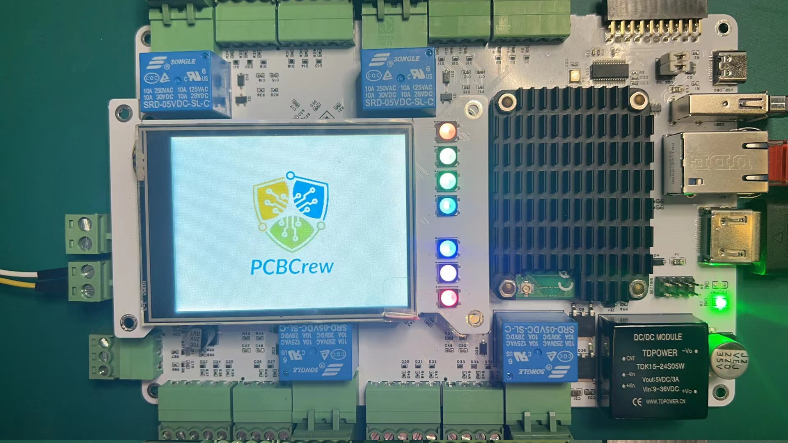

# [PCBCrew ™][pcbcrew] ILI9341 SPI LCD Driver for Raspberry Pi

> This library is based on the [ili9341_SPI_TouchScreen_LCD_Raspberry-Pi by BehindTheSciences][bts-lcd-lib], which is obsolete and not compatible with the Raspberry Pi OS version of this time of writing, 2023.

## Quickstart

Simply clone and run on Raspberry Pi

```sh
git clone https://github.com/pcbcrew-org/pcbcrew-raspi-spilcd
cd pcbcrew-raspi-spilcd/
python3 example.py
```

## Result of the `example.py`



---

[pcbcrew]: https://pcbcrew.com
[bts-lcd-lib]: https://github.com/BehindTheSciences/ili9341_SPI_TouchScreen_LCD_Raspberry-Pi
